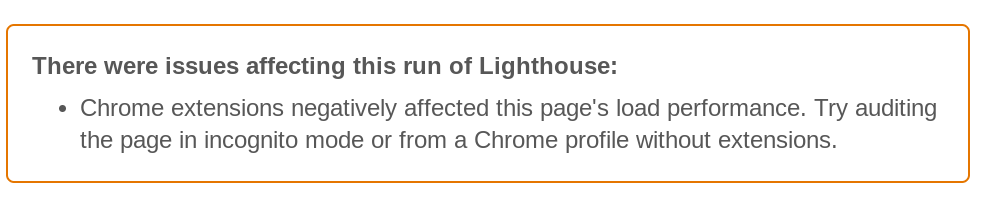

<!-- .slide: data-background="./images/pliers_2200.jpg" -->
<h1 class="title highlighter-light" style="text-align:right;">Dev Tools for  Performance</h1>
<h2 class="subtitle" style="color:#333;text-align:right;">Sia Karamalegos</h2>

---

## hi, i'm sia

[sia.codes](https://sia.codes/)

---

## [bit.ly/devtools-sia](https://bit.ly/devtools-sia)

---

## Exercise: Flying Blind ✈️

Pick a website you work on. Run it through each of these tools, keeping each open in separate tabs:

1. **Lighthouse** (DevTools audit tab, only check performance)
2. **PageSpeed Insights** [developers.google.com/speed/pagespeed/insights/](https://developers.google.com/speed/pagespeed/insights/)
3. **WebPageTest** [webpagetest.org/easy](http://webpagetest.org/easy)
4. **Test My Site** [testmysite.thinkwithgoogle.com](https://testmysite.thinkwithgoogle.com)
5. **RespImageLint** [ausi.github.io/respimagelint/](https://ausi.github.io/respimagelint/) (requires some set up)

Note: **Discussion**: What do you notice about each? What are the similarities/differences? What do you like/dislike?

---

## Testing Environments

 

<table class="fixed-two-column" id="invisible-gridlines">
  <thead>
    <tr>
      <th class="color-secondary">Lab/Synthetic</th>
      <th class="color-secondary">Field/Real User Monitoring (RUM)</th>
    </tr>
  </thead>
  <tbody>
    <tr>
      <td>
        <ul class="plus-minus" style="display:inline;">
          <li class="plus">Controlled environment</li>
          <li class="plus">Predefined network and device settings</li>
          <li class="plus">Reproducible for better performance debugging</li>
          <li class="minus">May not capture real-world bottlenecks</li>
        </ul>
      </td>
      <td>
        <ul class="plus-minus" style="display:inline;">
          <li class="plus">Performance data from <strong>real user page loads</strong> and interactions</li>
          <li class="minus">Limited data and performance debugging capability</li>
      </td>
    </tr>
  </tbody>
</table>

---

## Lab/Synthetic Environment Tools

_Emulated CPU and network throttling_

  
  
Chrome DevTools

  
  
Lighthouse

  
  
PageSpeed Insights

Note: DevTools for Network tab (load) and Performance tab (script execution costs)

---

> Your laptop is a filthy liar.

<small>Alex Russell, [Progressive Performance talk at Chrome Dev Summit 2016](https://www.youtube.com/watch?v=4bZvq3nodf4)</small>

Note: network and CPU throttling are not representative of real user experiences. mobile CPUs process in a completely different way, and heat management is especially different.

---

## Optimize for user devices and networks

  
<i class="fas fa-mobile-alt"></i> 2-5x difference in fastest vs slowest phones

  
<i class="fas fa-globe-africa"></i> 75% of worldwide mobile connections on 2G or 3G

  
<i class="fas fa-house-signal"></i> Not just developing countries but rural areas or spotty networks like conference wifi

  
<i class="far fa-chart-bar"></i> Use analytics data to profile your users and configure <a href="https://www.webpagetest.org/">webpagetest.org</a> to reflect them more closely

<small>[Can You Afford It?: Real-world Web Performance Budgets](https://infrequently.org/2017/10/can-you-afford-it-real-world-web-performance-budgets/)</small>

Note: Performance budgets at Google are $200 Android phone on a slow 3G network to target 5s initial load and 2s for subsequent. Converts to 130-170kb gzipped.

---

## Lab/Synthetic Environment Tools

_Real devices and networks_

  
  
WebPageTest &nbsp;

  
  
DevTools + connected device 📱

Note: Buy a shitty phone and connect it to your computer for on-device debugging. webpagetest.org/easy has a basic set up - $200 phone, slow 3G?

---

## WebPageTest

<small>https://twitter.com/HenriHelvetica/status/1109557588411203584</small>

---

## Field/RUM Testing Tools

_Publicly available data_

  
  
CrUX

  
  
PageSpeed Insights

  
  
Google BigQuery

<small>Chrome User Experience (CrUX) data is available in PageSpeed Insights or BigQuery.</small>

---

## Field/RUM Testing Tools

_Self-run data sent to your backend or analytics tool_

- Navigation Timing API
- Resource Timing API
- User Timing API for custom timings

<small>
  

    <a href="https://developers.google.com/web/fundamentals/performance/navigation-and-resource-timing/">Assessing Loading Performance in Real Life with Navigation and Resource Timing</a>
     <a href="https://www.keycdn.com/blog/user-timing/">User Timing API - Measuring User Experience Performance</a>
  

<small>

---

<!-- .slide: data-background="./images/tools_2200.jpg" -->

# More tools in the toolbox <!-- .element: class="highlighter-light" -->

---

## Test My Site

- Snazzy-looking and gives pretty pdf
- High-level data from WebPageTest and PageSpeed Insights
- Good for the speed scorecard and impact calculator

---

## RespImageLint

<small>[RespImageLint](https://github.com/ausi/respimagelint) is a bookmarklet linter for responsive images.</small>

Note: Lighthouse audits also does this better now, but I still like this quick tool and the prescriptive suggestions.

---

## Bundle Analyzers

`webpack-bundle-analyzer`

<small>Check out other options on [SurviveJS](https://survivejs.com/webpack/optimizing/build-analysis/)</small>

---

## MOAR Tools

- [Dev Tools Coverage analyzer](https://developers.google.com/web/tools/chrome-devtools/coverage)
- [Performance Budget Calculator](https://perf-budget-calculator.firebaseapp.com/)
- [Bundlephobia](https://bundlephobia.com/)
- [Cloudinary Website Speed Test Image Analysis Tool](https://webspeedtest.cloudinary.com/)

Note: Cmd+shift+p for "coverage"

---

<!-- .slide: data-background="./images/measures_2200.jpg" -->

# 📈 Metrics 📈 <!-- .element: class="highlighter-light" -->

---

> When optimizing for speed,  **user experience** should always  be your primary metric.

---

## User experience

1. When can I see the page? <!-- .element: class="fragment fade-in-then-semi-out" -->
2. When can I interact with it? <!-- .element: class="fragment fade-in-then-semi-out" -->
3. Is it delightful? <!-- .element: class="fragment fade-in-then-semi-out" -->

Note: By delightful I mean both is it stable and smooth.

---

## When can I see the page?

- Speed index measures how quickly the page contents are visually populated, but it's not simple<!-- .element: class="fragment fade-in-then-semi-out" -->
- Largest contentful paint measures when the largest image or text paint in the viewport occurs<!-- .element: class="fragment fade-in" -->
  - Removed elements are invalidated (splash screens)<!-- .element: class="fragment fade-in" -->
  - Larger weight in Lighthouse<!-- .element: class="fragment fade-in" -->

<small>[Largest Contentful Paint (LCP)](https://web.dev/lcp/), [Speed Index](https://sites.google.com/a/webpagetest.org/docs/using-webpagetest/metrics/speed-index)</small>

---

## When can I interact with the page?

<iframe width="560" height="315" src="https://www.youtube.com/embed/Lx1cYJAVnzA" frameborder="0" allow="autoplay; encrypted-media" allowfullscreen></iframe>

<small>End to End Apps with Polymer by Kevin Schaaf, Polymer Summit 2017</small>

---

## When can I interact with the page?

- Time to Interactive (TTI) measures how long it takes a page to become fully interactive<!-- .element: class="fragment fade-in-then-semi-out" -->
- Total blocking time (TBT) measures the time between First Contentful Paint (FCP) and TTI where the main thread was blocked for long enough to prevent input responsiveness.<!-- .element: class="fragment fade-in-then-semi-out" -->
- First Input Delay (FID) measures the delta between when an input event is received and when the main thread is next idle (field only).<!-- .element: class="fragment fade-in-then-semi-out" -->
- Large blocks of scripting on the main thread makes interaction worse.<!-- .element: class="fragment fade-in-then-semi-out" -->

<small>[How does TBT relate to TTI?](https://web.dev/tbt/#how-does-tbt-relate-to-tti), [First Input Delay](https://web.dev/fid/)</small>

Note: the point at which layout has stabilized, key webfonts are visible, and the main thread is available enough to handle user input within 50ms. The main thread is considered "blocked" any time there's a Long Task—a task that runs on the main thread for more than 50 milliseconds (ms). TBT will have a larger weight in Lighthouse.

---

## Is it delightful? Visual Stability...

<video controls width="800" autoplay loop>
  <source src="./images/layout-shift.mp4" type="video/mp4">
  Sorry, your browser doesn't support embedded videos.
</video>

---

## Cumulative Layout Shift** (CLS)

> measures the sum total of all individual layout shift scores for every unexpeceted layout shift that occurs during the entire lifespan of the page.

<small>[From web.dev](https://web.dev/cls/)</small>

---

## Is it smooth? Frame Rate...

Note: Frame rate or frames per second (fps), is one measure of responsiveness. Modern devices refresh their screens at a rate of 60 fps. Converting that to an individual frame, we theoretically have 16 ms to render. In actuality, the browser needs some of that time, so we should target 10ms per frame. Any more, and the human eye will be able to detect the jank or jitter.

---

## RAIL model for performance goals

- **Response**: process events in under 50ms
- **Animation**: produce a frame in 10ms (for 60fps devices)
- **Idle**: maximize idle time (to respond in 50ms or less)
- **Load**: deliver content and become interactive in under 5 seconds, 2 seconds for subsequent loads*

<small>[Measure Performance with the RAIL Model](https://developers.google.com/web/fundamentals/performance/rail)</small>

Note: R:Complete a transition initiated by user input within 100ms. A: Have 16ms, but browsers need about 6ms to render each frame. I: Maximize idle time to increase the odds that the page responds to user input within 50ms. L:on mid-range mobile devices with slow 3G connections

---

## Core Web Vitals

<small>[Web Vitals](https://web.dev/vitals/), [The Science Behind Web Vitals](https://blog.chromium.org/2020/05/the-science-behind-web-vitals.html)</small>

Note: Target is 75% of loads. "Core Web Vitals are the subset of Web Vitals that apply to all web pages, should be measured by all site owners, and will be surfaced across all Google tools. Each of the Core Web Vitals represents a distinct facet of the user experience, is measurable in the field, and reflects the real-world experience of a critical user-centric outcome."

---

## Exercise: Metrics

Look at the tools you ran earlier, and write down:

1. The site's speed index, LCP, TTI, TBT, FID, and CLS.
2. Which tools did you find them in?
3. Under what conditions were these run (device, network, emulated/real?

---

## Next level: User-centered metrics

- Twitter: [time-to-first-tweet](https://blog.twitter.com/engineering/en_us/a/2012/improving-performance-on-twittercom.html)
- Pinterest: [pinner-wait-time](https://medium.com/pinterest-engineering/driving-user-growth-with-performance-improvements-cfc50dafadd7)

<small>[Custom metrics](https://web.dev/custom-metrics/) on web.dev</small>

---

<!-- .slide: data-background="./images/sparks_2200.jpg" -->

# Set up Dev Tools #LikeABoss <!-- .element: class="highlighter-light color-secondary" -->

---

---

1. Set up a new Chrome profile with __no extensions__.
2. Open **Dev Tools > Settings > Experiments**, hit **shift** 6 times, turn on:
  - Timeline: event initiators (shows repaint caused by x)
  - Automatically pretty print...
  - Enable CSS grid debugging
  - Input events on Timeline overview
  - Timeline: invalidation tracking (like inline styles)
3. Restart Dev Tools (alt + r)

Note: Incognito can't test cache or long-term sessions

---

## Dev Tools High-Level Orientation

- **Network**: download time (waterfall)
- **Performance**: script and other execution costs (flame chart)
- **Lighthouse**: scores performance, PWAs, accessibility, etc.
- **Coverage**: shows used vs. unused bytes includes in the load

Note: Lots of other cool tools exist like local overrides, paint layers, etc.

---

## Chrome Dev Tools Network Tab

Note: Use **large request rows** to make size and time columns show more data. The size column now shows size over the wire (top) and size of the file put into the browser cache (bottom). For example, jpeg would have added headers and cookies. Time column now shows total elapsed time(top) and latency plus wait time (bottom). Subtracting the two gives download time (click then go to Timing to see actual download times). **sorting and filtering**: Click on a column header to sort. Use the filter box to only show .jpg or files from a specific domain. Use the minus sign for “not”, e.g. -domain: mydomain.com (useful for 3rd party search). Type just - to see all possibilities. **Right-click on the column headers** and enable the Priority column. Notice that HTML and CSS are highest. Images vary on placement, and JavaScript varies. Be careful: Scripts after images get deprioritized and iframe widgets can prioritize to highest because of the file type. **preview stuff from next slide**.

---

## Tricks + shortcuts

- **cmd + shift + p** searches settings like "Show/hide third party badges" and “Coverage”
- **magical shift key** - shift and hover over files: red shows the files downloaded by the file hovered, and green shows the file that initiated the download of the file hovered
- **Performance tab/flame chart**: Scroll up/down (zoom in/out), left/right (right/left). Keyboard shortcuts w/s (zoom in/out) and a/d (move right/left).
- **cmd + e**: start/stop recording
- **cmd + alt + f**: project-wide search
- **cmd + shift + o**: in sources tab in a CSS file, finds a selector

---

## WebPageTest Waterfall

Note: green - downloaded before started rendering so these files could be bottlenecks for rendering (js or css). Thumbnail view: scrolling moves the red line, gold border = visual change happened. https://webpagetest.org/result/200525_57_18cda7ecd946450919406f43121c34d0/

---

## Look for patterns of poor performance...

---

Note: No cert so HTTP1 can only download 6-ish files at once.

---

Note: Many connections to different domains.

---

Note: Chained critical path/request depth - one file calling the next file calling the next.

---

---

Note: Is the script critical? If not, async/defer. If so, put before CSS.

---

By default, scripts are HTML parser blocking.

<small>[HTML spec: scripting](https://html.spec.whatwg.org/multipage/scripting.html)</small>

---

`defer` downloads without blocking, then waits to execute after the document is parsed. `defer` scripts are executed in order.

<small>[HTML spec: scripting](https://html.spec.whatwg.org/multipage/scripting.html)</small>

Note: Scripts with the defer attribute will execute in the order in which they appear in the document.

---

`async` downloads without blocking, then executes right away, blocking HTML parsing.

<small>[HTML spec: scripting](https://html.spec.whatwg.org/multipage/scripting.html)</small>

Note: Scripts with the defer attribute will execute in the order in which they appear in the document.

---

`type=module` is deferred by default unless given an `async` attribute.

<small>[HTML spec: scripting](https://html.spec.whatwg.org/multipage/scripting.html)</small>

Note: Scripts with the defer attribute will execute in the order in which they appear in the document.

---

<small>[HTML spec: scripting](https://html.spec.whatwg.org/multipage/scripting.html), [`<script>`: The Script element](https://developer.mozilla.org/en-US/docs/Web/HTML/Element/script) on MDN</small>

---

<!-- .slide: data-background="./images/wrenches_2200.jpg" -->
<h1 class="title">Thanks!</h1>

  
Slides:  <a href="https://bit.ly/devtools-sia">bit.ly/devtools-sia</a>

  
Writing, resources, and more:  <a href="https://sia.codes/">sia.codes</a>

---

## Photo credits

- Tools in lower left corner Photo by <a href="https://unsplash.com/@jeshoots?utm_source=unsplash&amp;utm_medium=referral&amp;utm_content=creditCopyText">JESHOOTS.COM</a> on <a href="https://unsplash.com/s/photos/tools?utm_source=unsplash&amp;utm_medium=referral&amp;utm_content=creditCopyText">Unsplash</a>
- Many, many tools Photo by <a href="https://unsplash.com/@carlevarino?utm_source=unsplash&amp;utm_medium=referral&amp;utm_content=creditCopyText">Cesar Carlevarino Aragon</a> on <a href="https://unsplash.com/s/photos/tools?utm_source=unsplash&amp;utm_medium=referral&amp;utm_content=creditCopyText">Unsplash</a>
- Measuring tools Photo by <a href="https://unsplash.com/@yer_a_wizard?utm_source=unsplash&amp;utm_medium=referral&amp;utm_content=creditCopyText">Fleur</a> on <a href="https://unsplash.com/s/photos/tools?utm_source=unsplash&amp;utm_medium=referral&amp;utm_content=creditCopyText">Unsplash</a>
- Hands working with sparks Photo by <a href="https://unsplash.com/@christopher__burns?utm_source=unsplash&amp;utm_medium=referral&amp;utm_content=creditCopyText">Christopher Burns</a> on <a href="https://unsplash.com/s/photos/tools?utm_source=unsplash&amp;utm_medium=referral&amp;utm_content=creditCopyText">Unsplash</a>
- 2 wrenches on concrete Photo by <a href="https://unsplash.com/@tekton_tools?utm_source=unsplash&amp;utm_medium=referral&amp;utm_content=creditCopyText">Tekton</a> on <a href="https://unsplash.com/s/photos/tools?utm_source=unsplash&amp;utm_medium=referral&amp;utm_content=creditCopyText">Unsplash</a>
