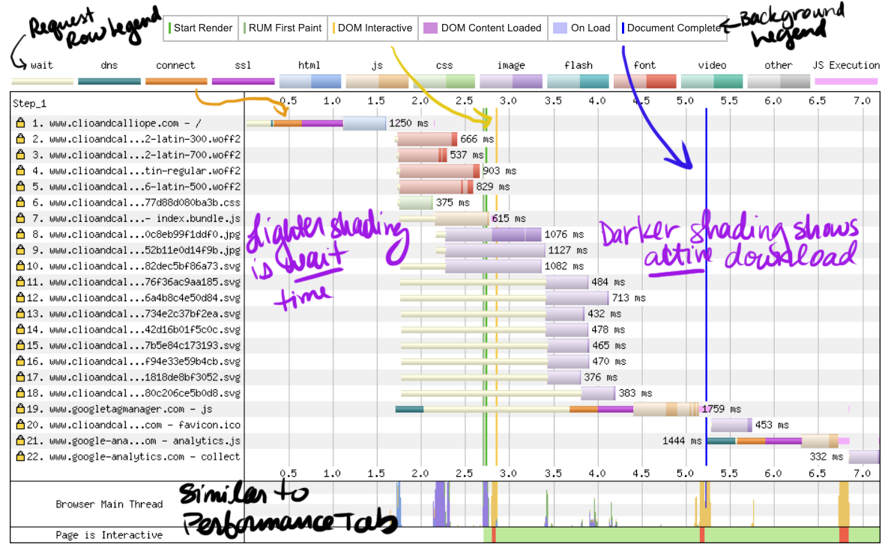

<!-- .slide: data-background="./images/pliers_2200.jpg" -->
<h1 class="title highlighter-light" style="text-align:right;">Dev Tools for  Performance</h1>
<h2 class="subtitle" style="color:#333;text-align:right;">Sia Karamalegos</h2>

---

## hi, i'm sia

[sia.codes](https://sia.codes/), [performance.shopify.com](https://performance.shopify.com/)

---

## [bit.ly/devtools-sia](https://bit.ly/devtools-sia)

---

<!-- .slide: data-background="./images/measures_2200.jpg" -->

# 📈 Metrics 📈 <!-- .element: class="highlighter-light" -->

---

> When optimizing for speed,  **user experience** should always  be your primary metric.

---

## User experience

1. Speed <!-- .element: class="fragment fade-in-then-semi-out" -->
2. Responsiveness <!-- .element: class="fragment fade-in-then-semi-out" -->
3. Stability <!-- .element: class="fragment fade-in-then-semi-out" -->

---

## Core Web Vitals

<small>[Web Vitals](https://web.dev/vitals/), [The Science Behind Web Vitals](https://blog.chromium.org/2020/05/the-science-behind-web-vitals.html)</small>

Note: Target is 75% of loads. LCP: Impacted by slow server response (TTFB), render-blocking resources (FCP), client-side rendering (FCP).

---

> FID is a participation award.

---

## Responsiveness, part deux

**Interaction to Next Paint** (INP): new, experimental metric that assesses how fast a page responds to user input

- Visual feedback is important<!-- .element: class="fragment fade-in" -->
- Duration from user interaction until next frame is presented after event handlers executed<!-- .element: class="fragment fade-in" -->
- "Good" is currently < 200 ms<!-- .element: class="fragment fade-in" -->
- Impacted by too much JS, other non-JS work on the main thread running concurrently with user interactions<!-- .element: class="fragment fade-in" -->

<small>[Interaction to Next Paint (INP)](https://web.dev/inp/)</small>

Note: measures the worst interaction when < 50 or the 98th percentile

---

## Supporting Cast

- Time to first byte (TTFB)
- First contentful paint (FCP)
- Total blocking time (TBT)

---

## Next level: User-centered metrics

- Twitter: [time-to-first-tweet](https://blog.twitter.com/engineering/en_us/a/2012/improving-performance-on-twittercom.html)
- Pinterest: [pinner-wait-time](https://medium.com/pinterest-engineering/driving-user-growth-with-performance-improvements-cfc50dafadd7)

<small>[Custom metrics](https://web.dev/custom-metrics/) on web.dev</small>

---

<!-- .slide: data-background="./images/testing.jpg" -->
# Test Environments <!-- .element: class="title highlighter-light" -->

---

## Testing Environments

 

<table class="fixed-two-column" id="invisible-gridlines">
  <thead>
    <tr>
      <th class="color-secondary">Lab/Synthetic</th>
      <th class="color-secondary">Field/Real User Monitoring (RUM)</th>
    </tr>
  </thead>
  <tbody>
    <tr>
      <td>
        <ul class="plus-minus" style="display:inline;">
          <li class="plus">Controlled environment</li>
          <li class="plus">Predefined network and device settings</li>
          <li class="plus">Reproducible for better performance debugging</li>
          <li class="minus">May not capture real-world bottlenecks</li>
        </ul>
      </td>
      <td>
        <ul class="plus-minus" style="display:inline;">
          <li class="plus">Performance data from <strong>real user page loads</strong> and interactions</li>
          <li class="minus">Limited data and performance debugging capability</li>
      </td>
    </tr>
  </tbody>
</table>

---

## Lab/Synthetic Environment Tools

_Emulated CPU and network throttling_

  
  
Chrome DevTools

  
  
Lighthouse

  
  
PageSpeed Insights

Note: DevTools for Network tab (load) and Performance tab (script execution costs)

---

> Your laptop is a filthy liar.

<small>Alex Russell, [Progressive Performance talk at Chrome Dev Summit 2016](https://www.youtube.com/watch?v=4bZvq3nodf4)</small>

Note: network and CPU throttling are not representative of real user experiences. mobile CPUs process in a completely different way, and heat management is especially different.

---

## Optimize for user devices and networks

  
<i class="fas fa-mobile-alt"></i> 2-5x difference in fastest vs slowest phones

  
<i class="fas fa-globe-africa"></i> 75% of worldwide mobile connections on 2G or 3G

  
<i class="fas fa-house-signal"></i> Not just developing countries but rural areas or spotty networks like conference wifi

  
<i class="far fa-chart-bar"></i> Use analytics data to profile your users and configure <a href="https://www.webpagetest.org/">webpagetest.org</a> to reflect them more closely

<small>[Can You Afford It?: Real-world Web Performance Budgets](https://infrequently.org/2017/10/can-you-afford-it-real-world-web-performance-budgets/)</small>

Note: Performance budgets at Google are $200 Android phone on a slow 3G network to target 5s initial load and 2s for subsequent. Converts to 130-170kb gzipped.

---

## Lab/Synthetic Environment Tools

_Real devices and networks_

  
  
WebPageTest &nbsp;

  
  
DevTools + connected device 📱

Note: Buy a shitty phone and connect it to your computer for on-device debugging. webpagetest.org/easy has a basic set up - $200 phone, slow 3G?

---

## WebPageTest

<small>https://twitter.com/HenriHelvetica/status/1109557588411203584</small>

---

## Field/RUM Testing Tools

_CrUX Publicly available data_

  
  
PageSpeed Insights

  
  
Google BigQuery

  
  
TREO Sitespeed

<small>Chrome User Experience (CrUX) data is available in PageSpeed Insights, BigQuery, the [CrUX Dashboard](https://rviscomi.github.io/crux-dash-launcher/), via the CrUX API, and most easily with [TREO](https://treo.sh/sitespeed).</small>

---

## Field/RUM Testing Tools

_Packages and vendors_

- [web-vitals npm package](https://github.com/GoogleChrome/web-vitals) + [Web Vitals Report](https://web-vitals-report.web.app/)
- Many analytics vendors ([Speedcurve](https://www.speedcurve.com/), [Calibre](https://calibreapp.com/), [Akamai mPulse](https://www.akamai.com/products/mpulse-real-user-monitoring) with [boomerang](https://github.com/akamai/boomerang))
- Starting to be bundled in more general analytics/deployment products and platforms

---

<!-- .slide: data-background="./images/tools_2200.jpg" -->

# More tools in the toolbox <!-- .element: class="highlighter-light" -->

---

## Bundle Analyzers

`webpack-bundle-analyzer`

---

## MOAR Tools

- [Lighthouse Treemap](https://sia.codes/posts/lighthouse-treemap/)
- [Dev Tools Coverage analyzer](https://developers.google.com/web/tools/chrome-devtools/coverage)
- [Bundlephobia](https://bundlephobia.com/)
- [keycdn Performance Test tool](https://tools.keycdn.com/performance)
- [Cloudinary Website Speed Test Image Analysis Tool](https://webspeedtest.cloudinary.com/)
- Loading in a browser with JavaScript disabled

<small>[An Informal Survey of Web Performance Tooling in 2021](https://sia.codes/posts/survey-web-performance-tooling/)</small>

Note: Cmd+shift+p for "coverage"

---

<!-- .slide: data-background="./images/rum.jpg" -->

  <h1>Step 1: Look at RUM</h1>
  
<a href="https://treo.sh/sitespeed">treo.sh/sitespeed</a>

---

<!-- .slide: data-background="./images/lab.jpg" -->

  <h1>Step 2: Dive deeper with lab testing</h1>
  
<a href="https://www.webpagetest.org/">WebPageTest</a>, Chrome Dev Tools

---

## WebPageTest Waterfall

Note: green - downloaded before started rendering so these files could be bottlenecks for rendering (js or css). Thumbnail view: scrolling moves the red line, gold border = visual change happened. https://webpagetest.org/result/200525_57_18cda7ecd946450919406f43121c34d0/

---

## Dev Tools High-Level Orientation

- **Network**: download time (waterfall)
- **Performance**: script and other execution costs (flame chart)
- **Lighthouse**: scores performance, PWAs, accessibility, etc.
- **Coverage**: shows used vs. unused bytes includes in the load

Note: Lots of other cool tools exist like local overrides, paint layers, etc.

---

## Chrome Dev Tools Network Tab

Note: Use **large request rows** to make size and time columns show more data. The size column now shows size over the wire (top) and size of the file put into the browser cache (bottom). For example, jpeg would have added headers and cookies. Time column now shows total elapsed time(top) and latency plus wait time (bottom). Subtracting the two gives download time (click then go to Timing to see actual download times). **sorting and filtering**: Click on a column header to sort. Use the filter box to only show .jpg or files from a specific domain. Use the minus sign for “not”, e.g. -domain: mydomain.com (useful for 3rd party search). Type just - to see all possibilities. **Right-click on the column headers** and enable the Priority column. Notice that HTML and CSS are highest. Images vary on placement, and JavaScript varies. Be careful: Scripts after images get deprioritized and iframe widgets can prioritize to highest because of the file type. **preview stuff from next slide**.

---

## Tricks + shortcuts

- **cmd + shift + p** searches settings like "Enable network request blocking" and “Coverage”
- **magical shift key** - shift and hover over files: red shows the files downloaded by the file hovered, and green shows the file that initiated the download of the file hovered
- **Performance tab/flame chart**: Scroll up/down (zoom in/out), left/right (right/left). Keyboard shortcuts w/s (zoom in/out) and a/d (move right/left).
- **cmd + e**: start/stop recording
- **cmd + alt + f**: project-wide search
- **cmd + shift + o**: in sources tab in a CSS file, finds a selector

---

## Look for patterns of poor performance...

---

Note: No cert so HTTP1 can only download 6-ish files at once.

---

Note: Many connections to different domains.

---

Note: Chained critical path/request depth - one file calling the next file calling the next.

---

---

Note: Is the script critical? If not, async/defer. If so, put before CSS.

---

# [Render-blocking resources](https://sia.codes/posts/render-blocking-resources/)

---

By default, scripts are HTML parser blocking.

<small>[HTML spec: scripting](https://html.spec.whatwg.org/multipage/scripting.html)</small>

---

`defer` downloads without blocking, then waits to execute after the document is parsed. `defer` scripts are executed in order.

<small>[HTML spec: scripting](https://html.spec.whatwg.org/multipage/scripting.html)</small>

Note: Scripts with the defer attribute will execute in the order in which they appear in the document.

---

`async` downloads without blocking, then executes right away, blocking HTML parsing.

<small>[HTML spec: scripting](https://html.spec.whatwg.org/multipage/scripting.html)</small>

Note: Scripts with the defer attribute will execute in the order in which they appear in the document.

---

`type=module` is deferred by default unless given an `async` attribute.

<small>[HTML spec: scripting](https://html.spec.whatwg.org/multipage/scripting.html)</small>

Note: Scripts with the defer attribute will execute in the order in which they appear in the document.

---

<small>[HTML spec: scripting](https://html.spec.whatwg.org/multipage/scripting.html), [`<script>`: The Script element](https://developer.mozilla.org/en-US/docs/Web/HTML/Element/script) on MDN</small>

---

<!-- .slide: data-background="./images/wrenches_2200.jpg" -->
<h1 class="title">Thanks!</h1>

  
Slides:  <a href="https://bit.ly/devtools-sia">bit.ly/devtools-sia</a>

  
Writing, resources, and more:  <a href="https://sia.codes/">sia.codes</a>

---

## Photo credits

- Tools in lower left corner Photo by <a href="https://unsplash.com/@jeshoots?utm_source=unsplash&amp;utm_medium=referral&amp;utm_content=creditCopyText">JESHOOTS.COM</a> on <a href="https://unsplash.com/s/photos/tools?utm_source=unsplash&amp;utm_medium=referral&amp;utm_content=creditCopyText">Unsplash</a>
- Many, many tools Photo by <a href="https://unsplash.com/@carlevarino?utm_source=unsplash&amp;utm_medium=referral&amp;utm_content=creditCopyText">Cesar Carlevarino Aragon</a> on <a href="https://unsplash.com/s/photos/tools?utm_source=unsplash&amp;utm_medium=referral&amp;utm_content=creditCopyText">Unsplash</a>
- Measuring tools Photo by <a href="https://unsplash.com/@yer_a_wizard?utm_source=unsplash&amp;utm_medium=referral&amp;utm_content=creditCopyText">Fleur</a> on <a href="https://unsplash.com/s/photos/tools?utm_source=unsplash&amp;utm_medium=referral&amp;utm_content=creditCopyText">Unsplash</a>
- Hands working with sparks Photo by <a href="https://unsplash.com/@christopher__burns?utm_source=unsplash&amp;utm_medium=referral&amp;utm_content=creditCopyText">Christopher Burns</a> on <a href="https://unsplash.com/s/photos/tools?utm_source=unsplash&amp;utm_medium=referral&amp;utm_content=creditCopyText">Unsplash</a>
- 2 wrenches on concrete Photo by <a href="https://unsplash.com/@tekton_tools?utm_source=unsplash&amp;utm_medium=referral&amp;utm_content=creditCopyText">Tekton</a> on <a href="https://unsplash.com/s/photos/tools?utm_source=unsplash&amp;utm_medium=referral&amp;utm_content=creditCopyText">Unsplash</a>
